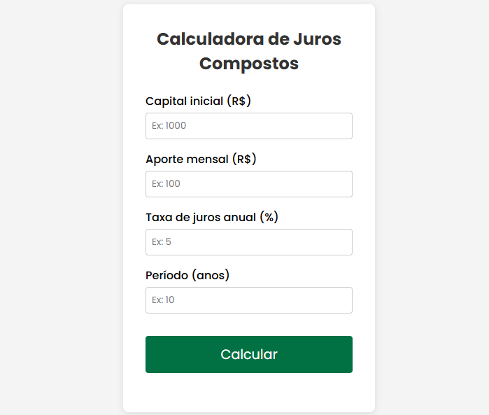

# Calculadora de Juros Compostos

Uma pequena aplicação web que calcula o montante acumulado de um investimento com aportes mensais e juros compostos.

---

## 📋 Funcionalidades

- Insira o **capital inicial** (R$)  
- Insira o **aporte mensal** (R$)  
- Insira a **taxa anual (%)**  
- Insira o **período (anos)**  
- Exibe o valor final acumulado após o período escolhido  

---

## 🛠️ Tecnologias

- **HTML5**  
- **CSS3**  
- **JavaScript (ES6+)**  

---

## 🚀 Como usar localmente

1. **Clone este repositório**  
   ```bash
   git clone https://github.com/gamagot/calculadora-juros-compostos.git

2. **Abra o projeto**
   ```bash
   cd calculadora-juros-compostos

3. **Abra o index.html no navegador**
Basta dar um duplo-clique no arquivo ou arrastar para a janela do navegador.

---

## 📦 Deploy no GitHub Pages
1. No seu repositório, vá em Settings > Pages.

2. Em Source, selecione a branch main (ou master) e clique em Save.

3. Aguarde alguns segundos — seu site estará disponível em:
```bash
https://<seu-usuário>.github.io/calculadora-juros-compostos/
```
---

## 🎨 Layout
<p align="center">  </p>

---

## ✍️ Autor
Gabriel Alves
🔗 https://github.com/gamagot
<h3 align="left">Contato:</h3>
<p align="left">
<a href="https://www.instagram.com/gabriel_magot/" target="blank"></a>
<a href="https://www.linkedin.com/in/gabriel-de-jesus-alves/" target="blank"></a>
</p>


---

<i>“Juros compostos é a oitava maravilha do mundo. Quem o entende, ganha; quem não, paga.”
– Atribuído a Albert Einstein</i>

